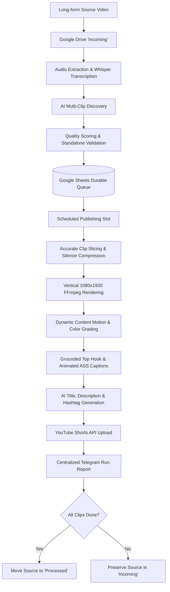
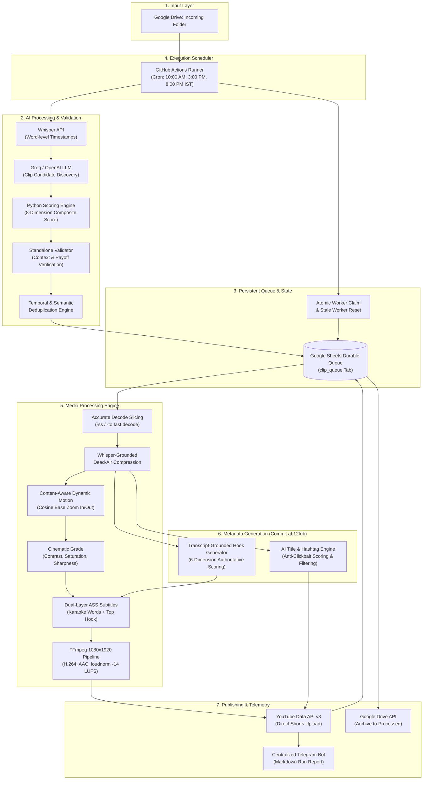
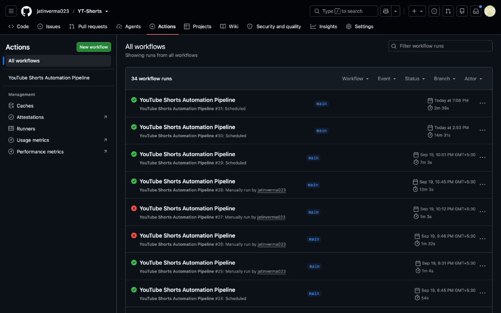
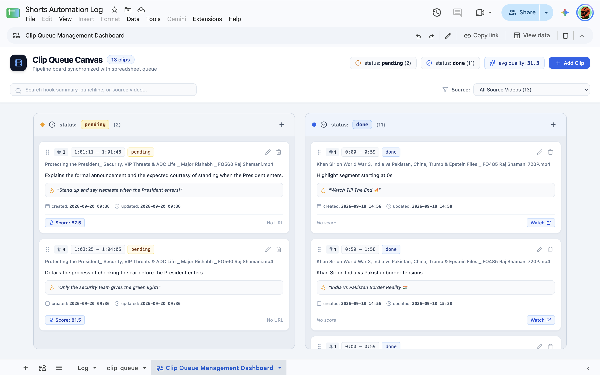
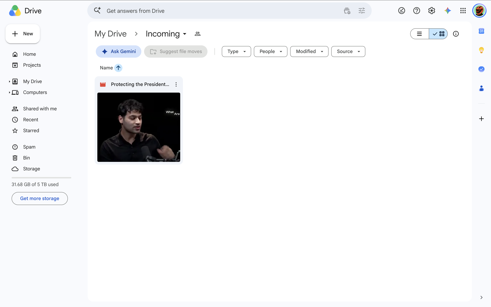

# YouTube Shorts Automation Pipeline

> An autonomous, cloud-native video pipeline that transforms long-form videos into publish-ready YouTube Shorts using AI clip discovery, deterministic validation, FFmpeg cinematic rendering, transcript-grounded metadata, scheduled publishing, and persistent Google Sheets queue management.

[](tests/)
[](https://www.python.org/)
[](https://ffmpeg.org/)
[](.github/workflows/pipeline.yml)
[](https://groq.com/)
[](https://developers.google.com/youtube/v3)
[](#)

This system automatically converts long-form videos into publish-ready YouTube Shorts using AI-powered clip discovery, deterministic validation, FFmpeg rendering, metadata generation, scheduled publishing, and persistent queue management. Designed for 100% unattended cloud execution on GitHub Actions runners, it eliminates manual video editing, subtitle generation, and upload scheduling.

---

## 2. What This Project Does

The pipeline operates completely autonomously: drop an original video file into a monitored Google Drive folder, and the system executes the entire production lifecycle:



1. **Monitors Google Drive**: Discovers incoming video files in FIFO chronological order.
2. **Transcribes Audio**: Generates word-level timestamps using Whisper (`whisper-large-v3` on Groq or OpenAI).
3. **Discovers Genuine Clips**: Analyzes full-context transcripts to identify high-retention segments (20–59 seconds).
4. **Validates Standalone Clarity**: Rejects incomplete thoughts, missing payoffs, or context-dependent openers.
5. **Manages Persistent Queue**: Stores validated clips in a durable Google Sheets queue.
6. **Schedules Publication**: Executes one clip per scheduled run slot (10:00 AM, 3:00 PM, 8:00 PM IST) to maintain steady channel growth.
7. **Renders Professional Shorts**: Centers and scales 16:9 footage onto a blurred 1080×1920 canvas with subtle micro-motion, color grading, and loudness normalization (-14 LUFS).
8. **Styles Dual-Layer Captions**: Burns high-visibility animated karaoke subtitles and context-grounded punchline headers in Romanized Hindi/English.
9. **Generates Grounded Metadata**: Synthesizes anti-clickbait titles, clean descriptions, and filtered hashtags strictly grounded in the clip's transcript.
10. **Publishes & Reports**: Directly uploads to YouTube via OAuth2 and sends a centralized telemetry report to Telegram.
11. **Safely Archives Source**: Preserves the source in `Incoming` until all detected clips have completed uploading, then moves it to `Processed`.

---

## 3. Architecture



---

## 4. End-to-End Pipeline

The automated pipeline executes across 21 structured stages:

1. **Source video discovery**: Polls Google Drive `Incoming` folder using Service Account credentials, filtering for finished video uploads.
2. **Transcription**: Extracts 16kHz mono audio and sends it to Whisper (`whisper-large-v3` via Groq or `whisper-1` via OpenAI) to acquire word-level timestamps and segment boundaries.
3. **Dynamic clip discovery**: The full transcript is chunked with 75-second overlaps and submitted to Groq/OpenAI to discover standalone, engaging narrative arcs between 20s and 59s.
4. **Quality scoring**: Python calculates an authoritative composite score (0–100) across 8 dimensions. Candidates scoring under 70.0 are rejected.
5. **Standalone-context validation**: Rejects clips lacking preceding setup, missing conclusions/punchlines, containing unresolved pronouns, or opening with context-dependent phrases.
6. **Deduplication**: Resolves temporal overlaps (`>= 35%`) in favor of higher-scoring candidates and eliminates semantic duplicates.
7. **Queue insertion**: Qualified clips are chronologically sorted and appended to the Google Sheets `clip_queue` tab with status `pending`.
8. **Scheduled clip selection**: On scheduled cron triggers, the runner atomically claims exactly **one** pending clip, transitioning its status to `processing`.
9. **Accurate clip extraction**: Downloads the source video and cuts the exact segment using decode-accurate FFmpeg seeking (`-ss` and `-to`).
10. **Silence/dead-air compression**: Analyzes Whisper word boundaries to compress pauses between words without robotic hard-cuts, maintaining natural 0.20s–0.28s breath buffers.
11. **Vertical video rendering**: Scales and places landscape footage (16:9) over a Gaussian-blurred, dimmed (-0.08 brightness) background filling the 1080×1920 portrait canvas.
12. **Visual enhancement**: Enhances video clarity with unsharp masking (0.60), subtle contrast expansion (+5%), and a peripheral radial vignette.
13. **Content-aware motion**: Applies cosine ease-in/ease-out dynamic zooms (1.00x to 1.04x) aligned with key narrative payoff timestamps.
14. **Hook generation**: Generates a short (3–8 words, max 42 characters) punchline hook strictly grounded in the clip's transcript, validated against forbidden clickbait templates.
15. **Caption generation**: Converts transcription words into ASS karaoke subtitles with pop-in word highlights in Romanized Hindi/English and places the hook at the top header.
16. **Title generation**: Synthesizes 5 candidate titles grounded in the clip transcript; scores them across 6 dimensions, selecting the highest-scoring title.
17. **Description + hashtag generation**: Creates a clean, conversational description ending with validated hashtags (`#Shorts` + topical tags; spam tags like `#viral` and `#fyp` are blocked).
18. **YouTube upload**: Authenticates via user OAuth2 refresh token and uploads the video as a public YouTube Short, checking for duplicate uploads prior to transfer.
19. **Queue completion**: Updates the Google Sheets queue row to `done` along with the live YouTube URL.
20. **Source video archival**: Evaluates remaining clips for the source video. Only when 100% of clips are completed is the source video moved from `Incoming` to `Processed`.
21. **Telegram notification**: Transmits an end-of-run report detailing stage statuses, runtime, clip indices, and live URLs to Telegram.

---

## 5. AI Clip Discovery

Clip discovery is **dynamic** and content-driven. The system does not target a fixed clip count per video; instead, it extracts genuine, self-contained highlights based on the natural flow of the conversation.

- **Dynamic Discovery**: A 15-minute video might yield 2 high-quality clips, while a 60-minute podcast might yield 7.
- **Safety Ceiling**: `MAX_DISCOVERY_CANDIDATES = 100` acts as a technical safety ceiling against malformed LLM outputs, not a target.
- **Content-Aware Chunking**: Long transcripts are divided into 14,000-character chunks with 75-second temporal overlaps, ensuring stories spanning boundaries are not fractured.
- **Temporal & Semantic Deduplication**: If two candidate clips overlap temporally by 35% or more (`CLIP_OVERLAP_THRESHOLD = 0.35`), the candidate with the higher composite score is retained. Clips sharing more than 60% hook keywords are also deduplicated.
- **Chronological Indexing**: After deduplication, qualified clips are numbered sequentially (Clip #1, Clip #2, etc.) according to their timeline order.

---

## 6. Clip Quality Scoring

Candidate quality is evaluated across **8 distinct dimensions**. While the LLM evaluates the dimensions, Python deterministically computes the authoritative composite score:

| Dimension | Weight | Description |
|---|:---:|---|
| **Hook Strength** | **20%** | Opening 3–5 seconds grabs attention immediately |
| **Standalone Clarity** | **15%** | Concept is fully understandable without full video context |
| **Payoff / Completion** | **20%** | Satisfying conclusion, punchline, or resolution |
| **Curiosity / Intrigue** | **10%** | Compels viewer to watch until the final second |
| **Emotional / Intellectual Impact** | **10%** | Inspires, educates, or entertains meaningfully |
| **Retention Potential** | **10%** | Pacing and density that avoids swipe-aways |
| **Context Independence** | **10%** | Measured as `10 - context_dependency` |
| **Punchline / Memorable Moment** | **5%** | Quotable, high-impact concluding remark |

$$\text{Composite Score} = \left( \sum_{i=1}^{8} \text{Score}_i \times \text{Weight}_i \right) \times 10.0$$

*Candidates scoring below `MIN_CLIP_QUALITY_SCORE` (70.0 / 100.0) are automatically rejected.*

---

## 7. Standalone Validation

A high quality score is insufficient if a clip cannot stand on its own. The `validate_standalone_context()` module performs deterministic validation:

- **Standalone Score Threshold**: Rejects candidates where standalone clarity scores below 7.0/10.0 (`MIN_STANDALONE_SCORE`).
- **Missing Setup (`missing_setup == True`)**: Rejects clips that start mid-explanation where foundational context occurred earlier in the long-form video.
- **Missing Payoff (`missing_payoff == True`)**: Rejects clips that cut off before delivering the answer, punchline, or promised insight.
- **Critical Unresolved References**: Identifies ambiguous opening pronouns (*"he"*, *"she"*, *"they"*, *"that event"*) that cannot be resolved within the clip itself.
- **Opening Context Risk**: Screens opening lines against known dependency patterns (*"And that's why..."*, *"As I said before..."*, *"Yes, absolutely..."*). If paired with unresolved references or context dependency $\ge 7.0$, the clip is rejected.
- **Context Boundary Isolation**: Surrounding transcript context is used strictly to evaluate independence; the clip boundaries themselves remain precise.

---

## 8. Persistent Queue & State Machine

To support ephemeral serverless environments (such as GitHub Actions runners), queue state is persisted in a Google Sheet `clip_queue` tab.

```
       ┌───────────┐
       │  PENDING  │ ◄────────────────────────────────┐
       └─────┬─────┘                                  │
             │ (Worker claims clip)                   │
             ▼                                        │
      ┌─────────────┐                                 │
      │ PROCESSING  │                                 │
      └──┬───────┬──┘                                 │
         │       │ (YouTube Quota Exceeded)           │ (Stale worker reset >60m /
         │       ▼                                    │  Quota reset >20h)
         │ ┌─────────────────────────┐                │
         │ │ RETRY_AFTER_QUOTA_RESET │ ───────────────┘
         │ └─────────────────────────┘
         ├──────────────────────┐
         │ (Upload Success)     │ (Terminal Failure)
         ▼                      ▼
    ┌──────────┐          ┌──────────┐
    │   DONE   │          │  FAILED  │
    └──────────┘          └──────────┘
```

### Queue Rules & Invariants:
- **One Clip Per Scheduled Trigger**: Each scheduled workflow run processes **exactly ONE pending clip**.
- **Atomic Claiming**: A worker verifies the row status is `pending` before setting it to `processing` with a current timestamp, preventing duplicate work.
- **Stale Processing Recovery**: Any row marked `processing` for longer than 60 minutes is automatically reverted to `pending`.
- **Quota Exhaustion Recovery**: If YouTube's daily API quota is hit (HTTP 403/429), the clip transitions to `retry_after_quota_reset` and is retried after 20 hours.
- **Source Video FIFO**: The queue finishes all clips belonging to the current source video before picking up a new video from `Incoming`.

---

## 9. Scheduling Architecture

The pipeline executes on a defined schedule configured in `.github/workflows/pipeline.yml`:

| Run Time (IST) | Run Time (UTC) | Cron Expression | Purpose |
|---|---|---|---|
| **10:00 AM IST** | **04:30 UTC** | `30 4 * * *` | Morning publication slot |
| **3:00 PM IST** | **09:30 UTC** | `30 9 * * *` | Afternoon publication slot |
| **8:00 PM IST** | **14:30 UTC** | `30 14 * * *` | Evening prime-time publication slot |

- **No Long-Running Sleep Loops**: GitHub Actions runners spin up, process one clip in ~2–4 minutes, and shut down cleanly, avoiding runner timeout costs.
- **Source Video Protection**: The original source video is **never** moved to `Processed` if pending, processing, or quota-waiting clips remain.
- **Discovery Resilience**: If clip discovery fails, the source video is preserved in `Incoming` for inspection rather than being archived prematurely.

---

## 10. Video Processing & FFmpeg Pipeline

Video rendering is handled by an optimized FFmpeg filter chain:

```
[0:v] 16:9 Landscape Source
  ├─► scale=1080:1920, crop, boxblur=25:5, eq=brightness=-0.08:saturation=1.05 ──► [bg]
  │
  └─► scale=1274:-2, crop=1080:ih, unsharp=0.6, eq (contrast=1.05) ─────────────► [fg]
                                                                                     │
[bg] + [fg] ──► overlay=(W-w)/2:(H-h)/2 ──► vignette ──► ASS Subtitles Burn ────► [vout]
                                                                                     │
[0:a] ──► loudnorm=I=-14.0:LRA=11:TP=-1.5 ──────────────────────────────────────► [aout]
```

- **Output Geometry**: 1080×1920 (9:16 vertical aspect ratio). Even pixel constraints (`trunc(iw/2)*2`) are enforced to prevent encoder crashes.
- **Composition**:
  - **Background (`[bg]`)**: 1080×1920 crop with `boxblur=25:5`, dimmed to `brightness=-0.08`, and color-boosted (`saturation=1.05`).
  - **Foreground (`[fg]`)**: Proportionally scaled to 1.18x (`FOREGROUND_SCALE = 1.18`) with centered cropping to maximize mobile screen fill.
  - **Portrait Handling**: 9:16 portrait sources bypass background blurring and use direct vertical scaling.
- **Pacing & Silence Compression**: `trim_silences_from_words()` identifies inter-word gaps using Whisper timestamps:
  - $\le 0.70\text{s}$: Retained as natural conversational pacing.
  - $0.70\text{s} - 1.20\text{s}$: Compressed, preserving a natural ~0.28s pause.
  - $> 1.20\text{s}$: Trimmed down to a clean 0.20s breath gap.
- **Color Grading**: Unsharp mask (`unsharp=5:5:0.60`), subtle contrast (`1.05`), saturation (`1.10`), and optional peripheral vignette (`vignette=PI/4:eval=init`).
- **Encoding Settings**: Video encoded with `libx264`, preset `veryfast`, `CRF 20`, pixel format `yuv420p`, and `-movflags +faststart`.
- **Framerate Invariance**: Defaults to native source framerate (`TARGET_FPS = 0`), avoiding jitter from unnecessary frame rate conversion.
- **Audio Mastering**: Audio encoded with AAC (128 kbps) and normalized via `loudnorm=I=-14.0:LRA=11:TP=-1.5` to meet YouTube Shorts loudness standards.

---

## 11. Caption System

Captions are generated as Advanced SubStation Alpha (`.ass`) subtitles burned directly into the video stream:

- **Dual-Layer Layout**:
  - **Top Punchline Hook (`HeaderPunchline`)**: Centered at the top (`Alignment: 8`, margin 280px), font size 52, white text with black outline.
  - **Spoken Subtitles (`Default`)**: Positioned in the lower third (`Alignment: 2`, margin 280px), font size 52, above YouTube Shorts UI elements.
- **Animated Karaoke Highlighting**: Spoken words dynamically transition from white (`&H00FFFFFF&`) to yellow highlight (`&H0000FFFF&`) as each word is spoken.
- **1–2 Line Phrasing**: `find_phrase_split()` groups words into balanced 3–8 word phrases (maximum 30 characters per line) to prevent visual clutter.
- **Romanized Hinglish Support**: When Hindi audio is detected, Devanagari script is converted into readable Romanized Hindi/Hinglish (`transliterate.py`) with 1:1 timestamp preservation. English terms are preserved in their original spelling.

---

## 12. Hook Generation

Hooks for the top header are generated strictly from the selected clip's transcript:

```
Selected Clip Transcript ──► LLM Candidate Generation (3-5 Hooks)
                                      │
                                      ▼
                        Deterministic Validation
                        ├─ 3–8 words, max 42 characters
                        ├─ Max 1 emoji
                        ├─ Rejection of generic placeholders
                        └─ Verbatim supporting text check
                                      │
                                      ▼
                        Python Authoritative Scoring
                        ├─ Grounding: 30%
                        ├─ Specificity: 20%
                        ├─ Curiosity: 20%
                        ├─ Relevance: 15%
                        ├─ Clarity: 10%
                        └─ Brevity: 5%
                                      │
                                      ▼
                        Highest-Scoring Valid Hook Selected
```

- **Clip-Only Isolation**: The hook generator receives only the transcript of the selected clip. It has no access to the full-length video title, source filename, or external context.
- **Forbidden Placeholders**: Phrases like *"WAIT FOR THE END"*, *"SHOCKING TWIST"*, or *"THE TRUTH ABOUT THIS"* are rejected automatically.

---

## 13. Metadata Generation

*Upgraded in commit [`ab12fdb`](https://github.com/jatinverma023/YT-Shorts/commit/ab12fdb60d0e8c8ac9e0e0496deb4b1afa324e56)*

Metadata is generated directly from the clip's transcript to maximize YouTube search and browse discovery without deceptive clickbait:

### Title Generation
- **Candidate Evaluation**: Generates 3–5 candidate titles from the clip transcript.
- **Authoritative Scoring**:
  - Grounding / Factual Support: **30%**
  - Specificity: **20%**
  - Curiosity: **20%**
  - Relevance: **15%**
  - Clarity: **10%**
  - Brevity (5–12 words, 35–65 characters): **5%**
- **Anti-Clickbait Rules**: Explicitly rejects blacklisted patterns (*"You won't believe"*, *"This changes everything"*, *"Secret revealed"*).
- **Repetition Prevention**: Verifies that the title does not duplicate the top header hook.
- **Deterministic Fallback**: If LLM calls fail, extracts an informative clause directly from the transcript.

### Description & Hashtags
- **Description**: 1–2 natural sentences summarizing the specific topic discussed in the clip.
- **Hashtag Filtering**: Includes `#Shorts` followed by 3–5 topical hashtags.
- **Spam Rejection**: Generic tags like `#viral`, `#fyp`, `#explore`, and `#foryou` are filtered out.

---

## 14. Production Example

Here is a real example of how a clip progresses through the system:

```
Source Video: "tech_podcast_episode_14.mp4" (Duration: 42m 18s)
│
├── Step 1: Ingestion & Transcription
│   └── Transcribed 6,842 words using Groq Whisper-large-v3
│
├── Step 2: Discovery & Scoring
│   └── 8 candidates found -> 3 qualified -> 1 temporal duplicate removed
│   └── Clip #1 [04:12 - 04:58] (Score: 88.5/100, Duration: 46.2s)
│   └── Clip #2 [18:30 - 19:14] (Score: 84.0/100, Duration: 44.0s)
│
├── Step 3: Queue Insertion
│   └── Inserted 2 rows in Google Sheets 'clip_queue' (status: pending)
│
├── Step 4: Scheduled Run #1 (10:00 AM IST)
│   ├── Claimed Clip #1 (Row 4 -> processing)
│   ├── Extracted slice [252.0s - 298.2s]
│   ├── Compressed 3 silences (>0.7s), trimming 2.4s of dead air
│   ├── Top Hook: "Why Silicon Valley is Moving 🏙️" (Score: 89.0)
│   ├── Title: "The Real Reason Tech Startups Leave SF #shorts" (Score: 87.5)
│   ├── Description: "A breakdown of why founders are relocating...\n\n#Shorts #Startups #SiliconValley"
│   ├── Uploaded -> https://youtube.com/shorts/3k9FjXyZaBc
│   ├── Updated Row 4 -> done
│   └── Preserved source video in 'Incoming' (Clip #2 remains pending)
│
└── Step 5: Scheduled Run #2 (3:00 PM IST)
    ├── Claimed Clip #2 (Row 5 -> processing)
    ├── Rendered & Uploaded -> https://youtube.com/shorts/8mNpQrStUvW
    ├── Updated Row 5 -> done
    └── All clips finished (2/2 done) -> Source video moved to 'Processed'
```

---

## 15. Production Screenshots

Visual assets and reference screenshots are organized in [`docs/screenshots/`](docs/screenshots/):

### GitHub Actions Automation Pipeline

*Automated GitHub Actions runner history showing scheduled publication slots and manual triggers.*

### Google Sheets Durable Queue

*Google Sheets persistent queue tracking clip state machine across pending, processing, and done statuses.*

### Google Drive Ingestion & Archival

*Google Drive file organization showing source video ingestion in Incoming and archival in Processed.*

| View | Asset Reference | Description |
|---|:---:|---|
| **Pipeline Workflow** | [`docs/screenshots/github-actions.png`](docs/screenshots/github-actions.png) | GitHub Actions runner showing automated triggers, cron history, and run logs |
| **Durable Queue** | [`docs/screenshots/google-sheets-queue.png`](docs/screenshots/google-sheets-queue.png) | Google Sheets `clip_queue` tab tracking clip state machine |
| **Drive Folders** | [`docs/screenshots/google-drive.png`](docs/screenshots/google-drive.png) | Source video preservation in `Incoming` and archival in `Processed` |

---

## 16. Demo & Telemetry Showcase

Every run concludes with a structured, centralized report dispatched to Telegram:

```
📊 YOUTUBE SHORTS RUN REPORT
Status: SUCCESS 🟢

⏱️ Run Information:
• Time: 2026-09-20 04:30:15 UTC
• IST: 2026-09-20 10:00:15 AM IST
• Runtime: 142.6s
• Trigger: schedule
• Workflow: Scheduled Publishing (Slot 10:00 AM IST)

📁 Source Information:
• Video: podcast_interview_ep02.mp4
• Duration: 38m 12s
• Source Folder: Incoming
• Destination: Preserved in Incoming (1 clip remaining)

⚙️ Execution Stages:
• Download: ✅ Done (8.2s)
• Slicing: ✅ Done (2.1s)
• Silence Trimming: ✅ Compressed 3 pauses (-2.1s)
• Visual Rendering: ✅ 1080x1920 30fps (68.4s)
• Hook Generation: ✅ "The Truth About High Inflation 📈" (Score: 88.0)
• Title Generation: ✅ "Why Inflation Never Really Drops #shorts" (Score: 86.5)
• YouTube Upload: ✅ Done (18.3s)
• Sheets Log: ✅ Updated Row 6 -> done

📈 Final Summary:
• Clip: #1 of 2
• URL: https://youtube.com/shorts/example_id
• Source Status: Preserved in Incoming
```

---

## 17. Project Structure

```
.
├── .github/
│   └── workflows/
│       └── pipeline.yml          # GitHub Actions 3-slot cron & dispatch workflow
├── docs/
│   └── screenshots/              # Production screenshot repository & guidelines
├── scripts/
│   ├── main.py                   # Central pipeline orchestrator & CLI
│   ├── config.py                 # Configuration parameters & environment loader
│   ├── clip_detection.py         # AI clip discovery & 8-dimension scoring engine
│   ├── hook_generator.py         # Transcript-grounded top header hook generation
│   ├── metadata_ai.py            # AI title, description & hashtag generation
│   ├── video_process.py          # FFmpeg rendering, silence compression & filters
│   ├── content_motion.py         # Content-aware dynamic emphasis motion engine
│   ├── transcribe.py             # Whisper integration & ASS caption synthesis
│   ├── transliterate.py          # Devanagari to Romanized Hinglish engine
│   ├── sheet_log.py              # Google Sheets queue & state management
│   ├── drive_utils.py            # Google Drive API upload/download/move utilities
│   ├── youtube_upload.py         # YouTube Data API v3 OAuth2 upload handler
│   ├── notify.py                 # Telegram / Slack notification dispatcher
│   ├── run_report.py             # Centralized pipeline observability & reporting
│   └── get_refresh_token.py      # One-time YouTube OAuth2 refresh token generator
├── tests/                        # 14 unit & integration test suites (211 tests)
├── requirements.txt              # Production Python dependencies
└── README.md                     # Comprehensive project documentation
```

---

## 18. Tech Stack

| Component | Technology | Purpose |
|---|---|---|
| **Runtime** | Python 3.11 / 3.9 | Core pipeline orchestrator and scoring engine |
| **Media Processing** | FFmpeg & static-ffmpeg | Slicing, scaling, color grading, audio normalization, ASS burning |
| **Speech-to-Text** | Whisper (`whisper-large-v3` / `whisper-1`) | Word-level audio transcription via Groq or OpenAI |
| **LLM Reasoning** | Llama 3.3 70B / GPT-4o-mini | Candidate clip discovery, hook synthesis, metadata generation |
| **State Persistence** | Google Sheets API v4 | Durable queue (`clip_queue`), state machine, and run logs |
| **Asset Storage** | Google Drive API v3 | Ingestion (`Incoming`), archival (`Processed`), and quarantine (`Failed`) |
| **Video Publishing** | YouTube Data API v3 | Direct YouTube Shorts upload using OAuth2 user credentials |
| **Automation** | GitHub Actions | Scheduled cron execution and serverless workflow management |
| **Telemetry** | Telegram Bot API | Centralized real-time execution summaries and error alerting |

---

## 19. Setup & Configuration

### Prerequisites
- Python 3.11 (or 3.9+)
- A Google Cloud project with **Drive API**, **Sheets API**, and **YouTube Data API v3** enabled
- An OpenAI or Groq API key
- A Telegram bot token and chat ID (optional, for alerts)

### Step 1: Repository Setup
```bash
git clone https://github.com/jatinverma023/YT-Shorts.git
cd YT-Shorts
python3 -m venv .venv
source .venv/bin/activate
pip install -r requirements.txt
```

### Step 2: Google Service Account (Drive & Sheets)
1. In Google Cloud Console, create a Service Account.
2. Create and download a JSON service account key.
3. In Google Drive, create two folders: `Incoming` and `Processed`. Share both with the service account email as **Editor**.
4. In Google Sheets, create a spreadsheet and share it with the service account email as **Editor**.
5. Save the full JSON key content for configuration.

### Step 3: YouTube OAuth2 Credentials
1. In Google Cloud Console, create an OAuth 2.0 Client ID (type: **Desktop app**).
2. Download `client_secret.json` to your project root.
3. Run the token generator:
   ```bash
   python scripts/get_refresh_token.py
   ```
4. Authenticate in the browser window with the Google account owning the YouTube channel. Note down the returned `YT_CLIENT_ID`, `YT_CLIENT_SECRET`, and `YT_REFRESH_TOKEN`.

### Step 4: GitHub Repository Secrets
Under your GitHub repository settings (**Settings** $\rightarrow$ **Secrets and variables** $\rightarrow$ **Actions**), add the following repository secrets:

- `DRIVE_INCOMING_FOLDER_ID`
- `DRIVE_PROCESSED_FOLDER_ID`
- `DRIVE_FAILED_FOLDER_ID` *(optional)*
- `GOOGLE_SERVICE_ACCOUNT_JSON` *(full JSON string)*
- `LOG_SHEET_ID`
- `GROQ_API_KEY` *(or `OPENAI_API_KEY`)*
- `YT_CLIENT_ID`
- `YT_CLIENT_SECRET`
- `YT_REFRESH_TOKEN`
- `TELEGRAM_BOT_TOKEN` *(optional)*
- `TELEGRAM_CHAT_ID` *(optional)*

### Step 5: Local Testing & Dry-Run
You can test the clip discovery and metadata engine locally without rendering video or uploading:
```bash
python scripts/main.py --dry-run /path/to/local_video.mp4
```

---

## 20. Environment Variables

All settings are configured via environment variables (loaded from `.env` locally or GitHub Secrets in cloud runners):

### AI & Language Models
- `GROQ_API_KEY`: API key for Groq Cloud (Llama 3.3 70B & Whisper-large-v3).
- `OPENAI_API_KEY`: API key for OpenAI (used as Whisper or GPT fallback).
- `GROQ_CHAT_MODEL`: Specific Groq model override (defaults to `llama-3.3-70b-versatile`).

### Google Drive & Service Account
- `GOOGLE_SERVICE_ACCOUNT_JSON`: Full JSON key string for Drive & Sheets authentication.
- `DRIVE_INCOMING_FOLDER_ID`: Folder ID where new long-form videos are uploaded.
- `DRIVE_PROCESSED_FOLDER_ID`: Folder ID where completed videos are archived.
- `DRIVE_FAILED_FOLDER_ID`: Folder ID where unprocessable files are moved.

### Google Sheets Queue
- `LOG_SHEET_ID`: Spreadsheet ID for run logs and clip queue.
- `LOG_SHEET_TAB`: Sheet tab name for run logging (default: `Log`).
- `CLIP_QUEUE_TAB`: Sheet tab name for durable queue (default: `clip_queue`).

### YouTube Upload
- `YT_CLIENT_ID`: OAuth2 Desktop Application Client ID.
- `YT_CLIENT_SECRET`: OAuth2 Desktop Application Client Secret.
- `YT_REFRESH_TOKEN`: Long-lived OAuth2 refresh token.

### Notifications
- `TELEGRAM_BOT_TOKEN`: Telegram bot token from @BotFather.
- `TELEGRAM_CHAT_ID`: Telegram chat/channel ID for run reports.
- `SLACK_WEBHOOK_URL`: Optional Slack webhook URL.

### Clip Discovery & Quality Scoring
- `MIN_CLIP_SECONDS`: Minimum duration for a Short (default: `20`).
- `MAX_CLIP_SECONDS`: Maximum duration for a Short (default: `59`).
- `MIN_CLIP_QUALITY_SCORE`: Minimum composite score threshold (default: `70.0`).
- `CLIP_OVERLAP_THRESHOLD`: Maximum temporal overlap ratio before deduplication (default: `0.35`).
- `MIN_STANDALONE_SCORE`: Minimum standalone clarity threshold (default: `7.0`).
- `MAX_DISCOVERY_CANDIDATES`: Technical safety ceiling for discovery (default: `100`).

### Video & Caption Formatting
- `FOREGROUND_SCALE`: Foreground zoom scale for 16:9 videos (default: `1.18`).
- `TARGET_FPS`: Framerate override (`0` preserves native video framerate).
- `ENABLE_SILENCE_REMOVAL`: Enable dead-air trimming (default: `true`).
- `SILENCE_THRESHOLD_SECONDS`: Pause duration threshold (default: `0.70`).
- `ENABLE_LOUDNORM`: EBU R128 audio normalization (default: `true`).
- `LOUDNORM_TARGET_I`: Integrated loudness target in LUFS (default: `-14.0`).
- `SUBTITLE_FONT`: ASS font name for subtitles (default: `Arial`).
- `CAPTION_LANGUAGE_MODE`: Language formatting mode (default: `romanized`).
- `ENABLE_TOP_PUNCHLINE`: Enable top hook header overlay (default: `true`).
- `DRY_RUN_LOG_ONLY`: Test mode flag to inspect without rendering/uploading.

---

## 21. Testing & Validation

The project maintains a comprehensive regression and unit test suite across 14 modules:

```bash
python -m unittest discover -s tests
```

```
----------------------------------------------------------------------
Ran 211 tests in 6.334s

OK
```

### Coverage Highlights:
- **`test_single_run_workflow.py`**: Validates the one-clip-per-trigger invariant, source video preservation in `Incoming`, and move to `Processed` upon completion.
- **`test_metadata_upgrade.py`**: Confirms 6-dimension title scoring, anti-clickbait rejection, repetition prevention, and grounded hashtag filtering.
- **`test_hook_generation.py`**: Verifies that hook generation receives only the selected clip transcript, validates constraints ($\le 42$ chars), and selects the highest-scoring candidate.
- **`test_standalone_validation.py`**: Tests rejection of missing setups, cut-off payoffs, and unresolved references.
- **`test_clip_scoring.py`**: Verifies deterministic composite score calculation across all 8 dimensions.
- **`test_visual_upgrade.py`**: Tests 1080×1920 layout filters, foreground scaling (1.18x), vignette filters, and audio loudnorm parameters.
- **`test_content_motion.py`**: Verifies timestamp-based cosine ease-in/out curves bounded at 1.04x zoom.
- **`test_caption_generation.py`**: Tests word-level ASS subtitle formatting, line splitting, and Romanized Hinglish conversion.
- **`test_sheet_log_enqueued_ids.py`**: Tests duplicate video detection and state recovery.

---

## 22. Production Design Principles

1. **Deterministic Python Validation**: LLM outputs are treated as untrusted suggestions. Critical decisions (scoring, thresholds, character limits, formatting) are calculated and enforced in Python.
2. **Persistent External State**: Runners are completely stateless; Google Sheets maintains the queue state machine across ephemeral runs.
3. **Idempotent Operations**: Prior to processing, the system checks whether a video or clip was already uploaded to prevent duplicates.
4. **Resilient Stale Recovery**: Automatically recovers from crashed runners by resetting stuck `processing` rows after 60 minutes.
5. **Quota Awareness**: Handles YouTube's daily API limits gracefully by deferring affected clips without failing the pipeline.
6. **Source File Safety**: A source video is only moved to `Processed` once 100% of its generated clips have been successfully uploaded.
7. **Zero Production Sleep Loops**: Scheduled cron triggers eliminate wasteful long-running sleep loops on cloud runners.
8. **Strict Transcript Grounding**: Hooks, titles, descriptions, and hashtags are synthesized strictly from the words spoken in the clip.
9. **Zero-Secret Codebase**: All API keys, OAuth tokens, and service credentials reside exclusively in environment secrets.

---

## 23. Future Improvements

Future improvements will be added as the production system evolves.

---

## 24. License

This repository and its production automation workflows are proprietary and configured for private operational use unless explicitly designated otherwise.
